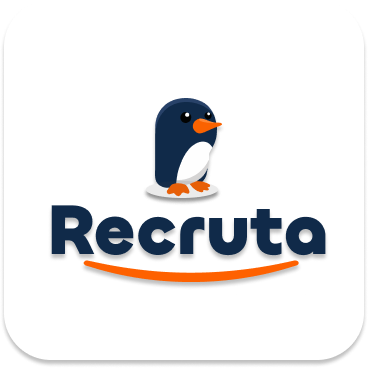

<div align="center">
  
  
  <h1>Recruta API</h1>
  
  <p>A modern, multi-tenant Applicant Tracking System (ATS) backend API designed for scale, resilience, and AI integration.</p>
</div>

---

## Sobre o Projeto

A **Recruta API** é o motor central para um sistema de recrutamento e seleção (ATS) de nível corporativo. O sistema gerencia o ciclo completo de aquisição de talentos, desde o provisionamento de empresas (tenants) e publicação de vagas até a gestão de portfólios de candidatos, acompanhamento no funil de contratação (Pipeline) e avaliações colaborativas.

Projetada com arquitetura orientada a eventos (Event-Driven) utilizando o padrão *Transactional Outbox*, a Recruta API isola as transações síncronas críticas (CRUD) dos processamentos pesados (como análise de currículos e *matching* semântico por Inteligência Artificial), garantindo alta disponibilidade e baixa latência.

## Arquitetura e Tecnologias

Toda a arquitetura do projeto foi rigorosamente construída seguindo os **Princípios SOLID** e Arquitetura Limpa (Clean Architecture). O código está dividido em módulos verticais isolados por domínio (Domain-Driven Design), garantindo alta coesão, baixo acoplamento e facilidade de manutenção a longo prazo.

**Stack Principal:**
*   **Framework:** [NestJS](https://nestjs.com/) v11 (Node.js)
*   **Linguagem:** [TypeScript](https://www.typescriptlang.org/) (Tipagem estrita end-to-end)
*   **Banco de Dados:** PostgreSQL com [Drizzle ORM](https://orm.drizzle.team/)
*   **Mensageria:** RabbitMQ (Integração assíncrona com Workers de IA em Python)
*   **Validação de Dados:** Zod

## Segurança, Governança e Infraestrutura

Para atender a requisitos de conformidade e segurança corporativa, o sistema conta com múltiplas camadas de proteção:

*   **Autenticação e Sessões:** Implementação nativa via [Better-Auth](https://better-auth.com/), garantindo gestão segura de tokens e sessões.
*   **Isolamento Multi-tenant (SaaS):** Todos os dados de domínio e queries ao banco de dados são estritamente isolados através do identificador `organizationId`. Acesso cruzado entre tenants é impossível por design.
*   **Controle de Acesso Baseado em Perfis (RBAC):** Os usuários recebem papéis organizacionais (`owner`, `admin`, `recruiter`, `member`). *Guards* do NestJS (`OrganizationContextGuard`, `OrganizationRoleGuard`) bloqueiam acessos não autorizados no nível da rota.
*   **Defesa de Borda e Anti-Bot:** Integração com o **Cloudflare Turnstile** para validação de endpoints públicos e críticos (ex: *sign-up*, *password reset*), bloqueando robôs sem prejudicar a experiência do usuário.
*   **Proteção contra Força Bruta:** Políticas de *Rate Limiting* aplicadas nas rotas de autenticação.
*   **Trilha de Auditoria (Audit Trail):** O módulo `audit` registra de forma inalterável todas as ações críticas e destrutivas da plataforma, identificando o usuário, o recurso afetado e a data da modificação.
*   **Armazenamento Isolado de Arquivos:** O *upload* de currículos (PDFs) e anexos confidenciais dos candidatos é realizado de forma privada no **Cloudflare R2** (armazenamento de objetos compatível com S3). O acesso aos arquivos é feito via URLs pré-assinadas com expiração configurável, garantindo que currículos não fiquem expostos publicamente na internet.

## Modelo de Domínio e Funcionalidades

A Recruta API está dividida em módulos autônomos que cooperam via eventos:

*   **Auth & Organizations:** Gestão do *tenant*, convites (`invitations`), assinaturas (`subscription-plans`) e controle de acesso.
*   **Jobs (Vagas):** Criação de posições com controle de status (`draft`, `published`, `closed`), níveis de senioridade, formato de trabalho e mapeamento de competências exigidas (*skills*).
*   **Candidates (Candidatos):** Portfólio unificado contendo dados pessoais, currículos originais (R2), histórico de experiências e competências.
*   **Applications (Candidaturas):** Vínculo transacional entre um candidato e uma vaga, garantindo unicidade através de constraints no banco.
*   **Pipeline:** Motor de fluxo de trabalho. Permite mover a candidatura através das etapas do processo seletivo (`applied`, `screening`, `interview`, `technical`, `offer`, `hired`, `rejected`), gerando um histórico detalhado de cada transição.
*   **Interview Notes:** Sistema de avaliação colaborativa onde recrutadores registram *feedbacks* estruturados atrelados a uma candidatura.
*   **Outbox & AI Results:** Sistema de enfileiramento transacional e recepção assíncrona de resultados de IA (cálculo de *match score* e geração de sumários semânticos através de *embeddings*).

## Estrutura da API (REST)

A API baseia-se em rotas REST sob o escopo `/api/v1`. Os dados são sempre retornados em envelopes consistentes e os erros são mapeados por um *Exception Filter* global.

> [!NOTE]
> Uma documentação interativa completa (OpenAPI / Swagger) que descreve exaustivamente cada endpoint, *payload* de requisição e modelo de resposta está embarcada e pode ser acessada na rota `/api/docs` durante a execução em desenvolvimento. A especificação garante `operationId` estáticos e estáveis para geração automática de clientes HTTP no frontend (via Orval ou ferramentas similares).

## Como Executar o Projeto

### Pré-requisitos

*   Node.js (LTS - v20 ou superior)
*   pnpm (v9+)
*   Servidor PostgreSQL (Local ou Docker)
*   Servidor RabbitMQ (Local ou Docker)
*   Credenciais do Cloudflare R2 e Site Key do Cloudflare Turnstile

### Execução em Desenvolvimento Local

1. Instale as dependências:
   ```bash
   pnpm install
   ```
2. Configure as variáveis de ambiente:
   ```bash
   cp .env.example .env
   ```
   *É obrigatório preencher as variáveis do banco de dados, RabbitMQ, assinaturas do Cloudflare Turnstile e as chaves de acesso ao Cloudflare R2.*
3. Execute as migrações do banco de dados (Drizzle):
   ```bash
   pnpm run db:migrate
   ```
4. Inicie o servidor:
   ```bash
   pnpm run start:dev
   ```

### Implantação e Execução via Docker

<!-- 
TODO: Inserir as instruções completas de configuração do docker-compose aqui.
Devemos incluir os passos para inicializar os serviços essenciais (Postgres, RabbitMQ), o backend NestJS e futuramente o Worker Python de IA em um único comando `docker compose up`.
-->
> [!TIP]
> Um ambiente conteinerizado completo utilizando `docker-compose` está sendo preparado. Em breve, as instruções detalhadas para executar a API e suas dependências de forma isolada estarão disponíveis nesta seção.
